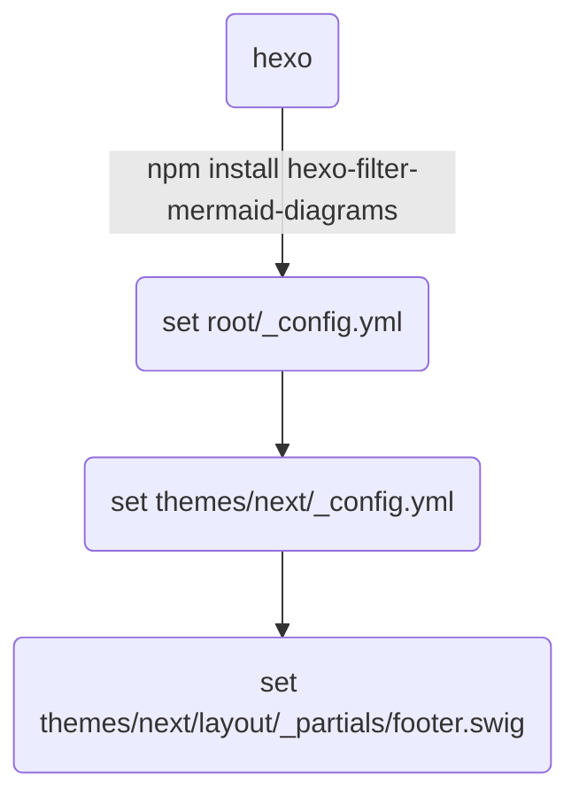

在 hexo (theme/next)架構下使用 mermaid 繪製流程圖

# How-to

安裝 package
```
npm install hexo-filter-mermaid-diagrams
```

在 hexo blog 的根目錄修改 `_config.yml`:
```
external_link: false
```

在 `themes/next/_config.yml` 檔案內有一處標記 mermaid 為 `enable: false` 需要改成 true：
```
# Mermaid tag
mermaid:  ## mermaid url https://github.com/knsv/mermaid
  enable: true
  version: "7.1.2" # default v7.1.2
  # Available themes: default | dark | forest | neutral
  theme: forest
```
>如果用 sublime text 編輯，可以用 `command + F`(mac) 直接搜尋 `mermaid` 比較快

同檔案內，往下拉有一區塊專門設置 CDN address，將 mermaid 的部分反註解：
```
# Script Vendors. Set a CDN address for the vendor you want to customize.
.
.
.
# Mermaid
  # Example:
  mermaid: //cdn.jsdelivr.net/npm/mermaid@8/dist/mermaid.min.js
  # mermaid: //cdnjs.cloudflare.com/ajax/libs/mermaid/8.0.0/mermaid.min.js
.
.
.
```

最後在 `themes/next/layout/_partials/footer.swig` 檔案中最後面加上：
```

  <script src='https://unpkg.com/mermaid@{{ theme.mermaid.version }}/dist/mermaid.min.js'></script>
  <script>
    if (window.mermaid) {
      mermaid.initialize({{ JSON.stringify(theme.mermaid.options) }});
    }
  </script>

```

以上就設置完成，可以使用 mermaid 語法了，流程圖示例如下：


流程圖示例代碼如下：
```

```

>若使用其他 theme 設置方法不太相同需要查看官方文件

# Reference

[mermaid](https://mermaidjs.github.io/#/)
[hexo-filter-mermaid-diagrams](https://github.com/webappdevelp/hexo-filter-mermaid-diagrams)
