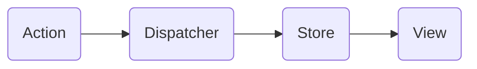
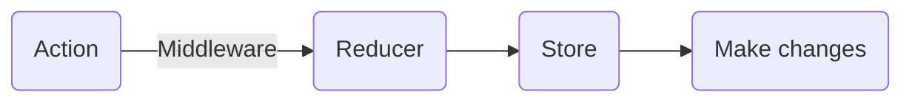

# What is MVC framework? Why we need?

MVC 架構是為了讓複雜程式碼能夠根據各自負責的功能目的做區分而出現的開發設計模式，分別是 modle、view、controller 三個部分，在權責區分清楚的情況下，可以有更好的擴充性和維護性。

modle 代表邏輯處理，view 負責 UI 的呈現，controller 則串連 modle 和 view，作為程式的流程控制。

舉例：使用者造訪一個部落格網站，點擊文章列表頁面，瀏覽器發出 request 給伺服器，server side 處理 request；將請求丟給對應的 controller，controller 向 model 存取資料，model 回應傳回資料並 render html 交給 controller，controller 再回傳一整份 html 檔給瀏覽器，瀏覽器顯示包含資料內容的 html 畫面。

# 前後端分離

後端專注在提供資料，前端專注在顯示資料，把 data 跟 view 完全切開來，這樣要替換語言或框架時也比較方便，後端只要確保 API 接口一致，就不會影響前端，反之也是一樣。

假如 server 有一天掛了，API 也跟著掛了，使用者依然可以造訪網頁，只是看不到資料而已，或者是你可以顯示出一個錯誤的圖案。但如果是舊的那種綁在一起的架構，server 一旦掛掉，你連畫面都渲染不出來。

而這樣的做法會讓前端自己管理 URL 的狀態，去決定現在要顯示哪一個頁面。

# SSR(Sever-side Rendering)

view 的畫面是在後端動態產生 html，render 完成再 response 給前端（瀏覽器），本質上是「每一個不同頁面就回傳一份不同的 html 檔案」，每一個頁面之間的狀態不會互相干擾。

# CSR(Client-side Rendering)

view 的畫面當前端拿到資料以後，才用 JavaScript 動態的產生，把內容填到網頁上面，並且需要管理不同頁面，根據路徑或用 hashtag 管理畫面切換。
前端 render 的難題在：「要怎麼只更新部分畫面，而不是暴力的每次都砍掉重練」。

# SPA(Single-Page-Application)

所有個內容都由前端用 JavaScript 動態產生，用 AJAX 拿資料並搭配 JavaScript 來做畫面上的處理。
與之對應的概念是 MPA，Multiple Page Application。

- 前端、後端各自有 MVC 框架
前端如果利用 SPA 來實作的話，會把原本應該是後端處理的一部份職責給搬到前端去，例如說狀態的管理跟路由；以往 Server 根據不同的路徑對應到不同的 Controller，進而渲染出不同的 View，可是現在 Server 無論什麼路徑都會輸出同一個檔案（index.html），所以你在前端也要判斷現在的網址是哪個，才能決定在前端應該渲染出哪個畫面，因此前端也開始需要 MVC 架構了，也就是由 router 去分類路徑並交給 controller 去分別連接 model 和 view。
藉由前後端各自的架構，後端只負責輸出資料，前端來負責抓資料跟渲染畫面。把前後端完完全全的切開了，就算後端壞掉，前端還是看得到畫面（只是可能會顯示個錯誤畫面之類的）；前端壞掉，後端還是能安穩的輸出資料供其他服務使用。

- SEO 問題
由於 SPA 是由前端的 JavaScript 動態產生內容，因此如果你對 SPA 的網站按下右鍵 -> 檢視原始碼，只會看到空蕩蕩的一片，只看得到一個 JavaScript 檔案跟一些最基本的 tag，這對於 SEO 的影響而言是不好的。
強大的 Google 的爬蟲其實支援執行 JavaScript，所以他依然會 index 你在前端渲染之後的頁面，但還有其他很多搜尋引擎，有些可能沒有像 Google 這麼強大，碰到 SPA 就只能索引空蕩蕩的 HTML，內容幾乎空白。
既然問題出在「第一次渲染」，在第一次渲染的時候把該輸出的資料都輸出(運用 server-side rendering)，對使用者來說還是一個 SPA，差別在於使用者接收到 HTML 的時候，就已經有完整的資料了，第一個頁面由 Server side render，之後的操作還是由 Client side render。

# Flux 

Flux 是一種架構設計模式，幫助你撰寫有條理的前端架構，用於管理控制應用程式中資料的流向，確保資料是 one-way data flow，資料的定義不限於指來自 server 的邏輯資料，也包括 view 的變化等。 在 flux 的架構中，Store基本上是你唯一可以操作資料與儲存資料的地方。

Flux Pattern 是這樣的：

- Flux 中有四位主要角色：

1. Action：規範所有改變資料的動作，讓你可以快速掌握整個 App 的行為。
2. Dispatcher：將目前發生的行為，告知給所有已註冊的 Store。
3. Store：存放資料和業務邏輯，並且只提供 getter API 讓人取得資料。
4. View：根據資料渲染 UI 和傾聽使用者的操作事件。

當 action 被觸發後，View 就會透過 Dispatcher dispatch 出一個 Action，該 Action 可以包含一個 payload，說明你想做什麼事情以及你需要操作什麼資料，在 Store 資料做完更新後，要告訴前端頁面去刷新視圖(view)。

- Flux 的特性：
1. 單向資料流：改變資料的行為都必須經過 Action、Dispatcher，再到 Store。
2. Single Source of Truth：資料統一存放於 Store，View 要資料都需跟 Store 拿。

- Flux 的優點：
用更清晰的模式，規範資料和頁面複雜互動情境下的資料流。

事實上，MVC 跟 Flux 都只是一個概念，因此有各種不同的實作，加上MVC在資料流的處理上，並不像Flux一般有較為明確的定義，多數時候Model的更動與View的刷新可能會透過Controller來管理，讓Model單純存放data。

如此一來，假若今天 View 的操作更動了 Model，而 Model 的變化又刷新了 View，在系統龐大的時候，一來一往，就會讓資料與頁面狀態變得非常複雜，要追蹤某個頁面的變動到底是誰觸發的，或是哪個資料改變了，必須從 Controller 去慢慢 trace。而若是遵照 Flux 的流程，任何 View 的 update 都只要去追蹤其 State 的來源 Store 即可，有一個明確的 flow 可以遵循，並且每個 View 所需要監聽的資料來源，可以依照 Store 來區分，資料流不會互相干擾，而且 Flux 能夠更輕鬆的做出更小單元的 Unit test，這是複雜的 Controller 難以達成的。

# React + Redux => 解決 MVC 架構問題

- React 解決什麼問題？
React 是專注在 MVC 架構中的 view，以 state 來管理介面變化的開發框架，透過 virtualDOM 在 state 改變時只重新 render 改變的地方，不需要在頁面切換或資料狀態更新、介面變化時重新 render 整個畫面，有效增進了應用程式的效能和使用者體驗。
React 把更改 state 的邏輯寫在各自的 component，然而當項目的邏輯變得越來越複雜的時候，將難以釐清 state 和 view 之間的對應關係：一個 state 的變化可能引起多個 view 的變化，一個 view 上面觸發的事件可能引起多個 state 的改變，需要對所有引起 state 變化的情況進行統一管理，於是就需要 Redux。

- Redux 解決什麼問題？
Redux 受到幾個 Flux Pattern 重要特質的影響，Redux 透過單一的狀態樹將所有 state 存於一個物件中，並由 Store 去管理；一律透過 action 描述更新動作，經過 Reducer 來變更 state。
Reducer 根據 action 物件和舊資料回傳新資料，因此你可以紀錄 action，並重新調用 reducer 函數來得到一樣的狀態，幫助我們做可預測的狀態管理，能夠追蹤 state 和資料變化，更好維護而且資料之間不會互相干擾。
Redux Pattern:

**所以使用 Redux + React，可以促進維護性和可擴展性。**

- Redux 和 Flux pattern 不同的地方在於： 
  1. Redux 只有一個 store，業務資料都存於一個狀態物件中，並由 Store 去管理；Flux 裡面會有多個 store，分別管理不同資料。
  2. Redux 中更新的邏輯不在 store 中執行而是由 reducer 負責執行；Flux 在 store 裡面執行更新邏輯，當 store 變化的時候再通知 controller-view 更新自己的數據。
  reducer 是一個純函數，這個函數被表述為(previousState, action) => newState，它根據應用的狀態和當前的 action 推導出新的 state 。 Redux 中有多個 reducer，每個 reducer 負責維護應用整體 state 樹中的某一部分，多個 reducer 可以通過 combineReducers 方法合成一個根 reducer，這個根 reducer 負責維護完整的 state，當一個 action 被觸發，store 會調用 dispatch 方法向某個特定的 reducer 傳遞該 action，reducer 收到 action 之後執行對應的更新邏輯然後返回一個新的 state，state 的更新最終會傳遞到根 reducer 處，返回一個全新的完整的 state，然後傳遞給 view。
  3. Redux 沒有 Dispatcher 的概念，它使用 reducer 來進行事件的處理，Store 提供 dispatch API 來傳遞 action 物件；Flux 的 Dispatcher 負責將 action 物件傳遞給每個 Store。
  Redux 和 Flux 之間最大的區別就是對 **store/reducer** 的抽象，Flux 中 store 是各自為陣的，每個 store 只對對應的 controller-view 負責，每次更新都只通知對應的 controller-view；而 Redux 中各子 reducer 都是由根 reducer 統一管理的，每個子 reducer 的變化都要經過根 reducer 的整合。

# Reference 

[跟著小明一起搞懂技術名詞：MVC、SPA 與 SSR 2018](https://medium.com/@hulitw/introduction-mvc-spa-and-ssr-545c941669e9)
[Node.js-Backend見聞錄(10)：關於後端觀念(六)-關於MVC 2017](https://ithelp.ithome.com.tw/articles/10194968)
[前後端分離與 SPA 2017](https://blog.techbridge.cc/2017/09/16/frontend-backend-mvc/)
[從 Flux 與 MVC 的差異來簡介 Flux 2016](https://blog.techbridge.cc/2016/04/29/introduce-flux-from-flux-and-mvc/)
[MVC是一個巨大誤會 2015](http://blog.turn.tw/?p=1539)
[浅谈 React、Flux 与 Redux 2016](https://imweb.io/topic/57711e37f0a5487b05f325b5)
[深入淺出 Redux 2016](https://medium.com/4cats-io/%E6%B7%B1%E5%85%A5%E6%B7%BA%E5%87%BA-redux-7b08403c4957)

# 延伸閱讀

[Connect Redux part to React](https://chinyun.github.io/myblog/2019/11/05/Redux-connect-Redux-part-to-React/)
