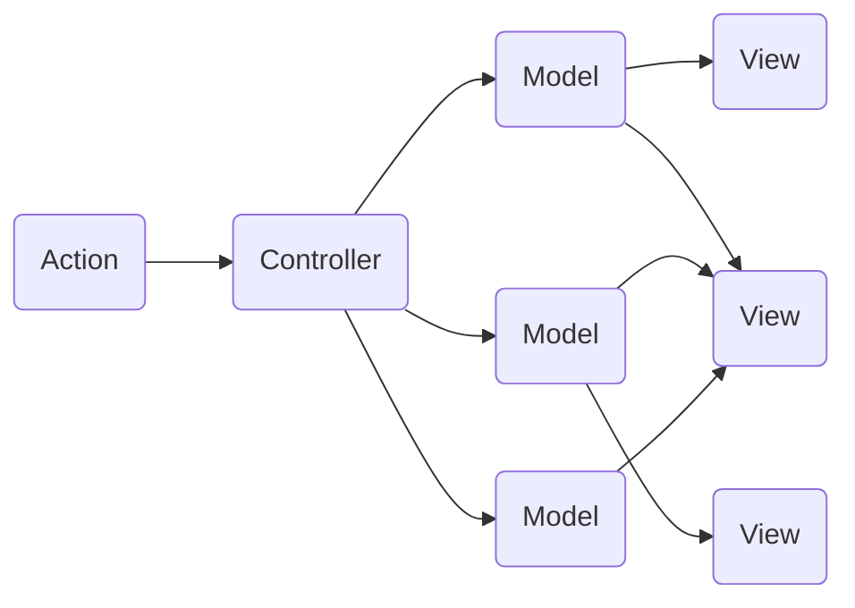
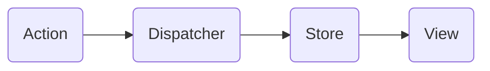
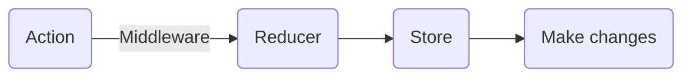

# How React manage State

React 使用單向數據流，父元件會把自身的 state 作為 props 傳遞給子元件，以此來共享資料。

根據官方文件描述：「 React Componenet 除了接收資料外（ 透過 `this.props` 存取 ），也可以保存自身的 state （透過 `this.state` 存取）。當一個 component 的 state 改變的時候，產生的標記語法將會透過自動重新呼叫 `render()` 更新。」

React Componenet 變更 state 的唯一方法是用 `this.setState()`，而且 state 只能在自身的 Componenet 內變更，所以當應用程式的規模越來越大、元件越來越多，需要共通使用的 state 也會越來越多。 

# Lifting State Up

隨著應用程式增加更多功能，同一個 state 可能需要被多個同層級或非父子關係的元件使用，以反應相同的資料變化。此時這個 state 必須被**提升**到最靠近他們的共同上層元件(ancestor)，再以 props 的形式傳遞給其他元件使用，這個過程稱為**狀態提升**(Lifting State Up)。

根據官方文件：「 在 React 應用程式中，對於資料的變化只能有一個唯一的「真相來源」。通常來說，state 會優先被加入到需要 render 的 component。接著，如果其他的 component 也需要的話，你可以提升 state 到共同最靠近的 ancestor。你應該依賴**上至下的資料流**，而不是嘗試在不同 component 之間同步 state。」

但不斷提升 state 的結果可能是許多 state 被以 props 形式不斷傳遞到子元件，而需要改變 state 時也必須將 function 以 props 傳遞到子元件，在子元件被觸發後，在上層元件內呼叫 `this.setState()`。如此一來，使用者操作應用程式改變資料等不同的 functions 被分散在各個元件，不僅不好維護，也容易因為 state 更新先後的問題引起錯誤。

# Why Redux

Redux 由 Dan Abramov 開發：「 Redux provides a solid, stable and mature solution to managing state in your React application. Through a handful of small, useful patterns, Redux can transform your application from a total mess of confusing and scattered state, into a delightfully organized, easy to understand modern JavaScript powerhouse.」

Redux 受到幾個 Flux Pattern 重要特質的影響，過去的 MVC(Model-View-Controller) Pattern 是這樣的：

而 Flux Pattern 是這樣的：

隨著 App 成長， state management 越來越複雜，所以我們會發現使用 Flux Pattern 這樣的邏輯是有效率的。

### Redux Pattern

### Redux 的優點

- Good for managing large state.
- Useful for sharing data between containers.
- Predictable state management using the 3 principles:
  1. Single source of truth - have one big object that describes the entire state
  2. State is read only - can only be modified by dispatching actions.
  3. Changes using pure function - receives an input and always return s an output that is predictable.

>To dispatch state mutations you have to write a function that takes the previous state of the app and the action being dispatched, then return the next state of the app. This function is called the **Reducer**.

Redux help developer thinking in a way of "how can we build an app that is able to scale with thousands of user interactions" and "how can we make it that the information flows from one to another into a predictable view, a system that is predictable."

### Conclusion

整理為什麼使用 Redux + React 的方式管理 state 的理由：

1. 更有效率的管理 state：
Redux 採集中管理 state，再分配給需要該 state 的元件，因此不需要一直傳遞 props。

2. 更有邏輯的管理 state：
在 Redux 管理下，一律透過 action 描述更新動作，經過 Reducer 來變更 state。

3. 更好維護：
使用上結合兩者，將 UI 的 state 交給 React，將 Data 的 state 交給 Redux，當需要修改時，可以更快找到需要修改的地方。

但並不是所有 React 應用程式都需要 Redux，需要判斷 state tree 是否很複雜：

1. 應用程式需要經常變化 UI
2. 許多非父子關係的元件共用相同資料或以相同方式更新 state
3. 同一個 state 受到多種不同方式更新

如果有這些狀況可以使用 Redux 來管理 state。

# Reference

[React Docs](https://zh-hant.reactjs.org/docs/lifting-state-up.html)
[Redux Docs](https://egghead.io/courses/getting-started-with-redux)
