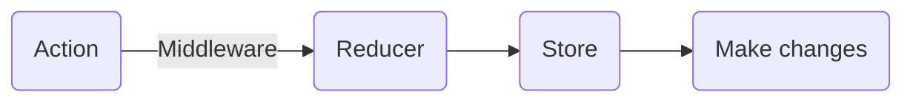

以下筆記如何在 react app 中引入 redux： 
示範 code 專案：[Tripper-app-redux](https://github.com/chinyun/Tripper-app-redux/blob/master/src/index.js)

# 程式碼
in Tripper-app-redux's index.js:
```
import React from 'react';
import ReactDOM from 'react-dom';
import { Provider } from 'react-redux';
import { createStore, applyMiddleware, combineReducers } from 'redux';
import { createLogger } from 'redux-logger';
import thunkMiddleware from 'redux-thunk';
import { requestLogIn, routeChange, requestData } from './reducers';
import App from './containers/App';

const logger = createLogger();

const rootReducer = combineReducers({requestLogIn, routeChange, requestData});
const store = createStore(rootReducer, applyMiddleware(thunkMiddleware, logger));

ReactDOM.render(
  <Provider store={store}>
    <App/>
  </Provider>, document.getElementById('root'));
```

in Tripper-app-redux's App.js:
```
import { connect } from 'react-redux';
import { routeChange } from '../actions';
.
.
.
const mapStateToProps = (state) => {
  return {
    user: state.requestData.user,
    journeys: state.requestData.journeys,
    initialJourney: state.requestData.initialJourney,
    journeyList: state.requestData.journeyList,
    route: state.routeChange.route,
    isSignedIn: state.requestLogIn.isSignedIn
  }
}

const mapDispatchToProps = (dispatch) => {
  return {
    onRouteChange: (route) => dispatch(routeChange(route))
  }
}
.
.
.

export default connect(mapStateToProps, mapDispatchToProps)(App);
```

# Redux Store and Provider

`<Provider></Provider>`包住`<App>`他會把 store 用 props 傳給所有 App 包含的子組件。
The logger will catch the actions and console.log() the action that is going to go to the reducer.

Store binds together the 3 principles fo Redux:

1. The entire state of the application will be represented by one JavaScript Object. ->  Store holds the current application state object. 
2. The state is read only, and can only be modified by dispatching actions. -> Store allows you to dispatch actions.
3. To specify how actions change state tree, the reducers should be pure functions. -> When you create the Store, **you need to specify the Reducer that tells how states updated with actions.**

Store 有三個重要的 methods:
1. getState(): run console.log(store.getState()) => get the current state of the Redux Store.
2. **dispatch(): dispatch actions to change the state of the application.**
3. subscribe(): register a callback that the redux store will call any time an action has been dispatched. So you can update the UI of application to reflect the current application's state.

運用 `combineReducers()` method 將多個 reducer 綁在一起變成一個，`createStore()`則負責建立 store，接受兩個參數：要監聽的 reducer、用 applyMiddleware() 加入要使用的 middleware。

# Connect

`connect()` are those which one of these components we want to be smart or be aware that the redux library exists and they subscribe to the changes. The connect function is optimized in order for us to avoid using somthing called `store.subscribe()`. It is a higher order function, means that a function that return another function. Through connect function, App component now could listen to the states that `mapStateToProps` gives and interested in actions that `mapDispatchToProps` gives to the component.

# Redux Middleware

Middleware is the suggested way to extend Redux with custom functionality. Middleware lets you wrap the store's dispatch method for fun and profit. The key feature of middleware is that it is composable. Multiple middleware can be combined together, where each middleware requires no knowledge of what comes before or after it in the chain.
Middleware 就像一個 tunnel，在 action 到 reducer 的階段之間建立通道，在 dispatch actions 時適時採取相應的行為。 Middleware helps us to handle side effects, monitor each one of our actions. We can listen to what logging output each one of these actions happen. It provides a third-party extension point between dispatching an action, and the moment it reaches the reducer.

Redux Pattern:

在 Action 和 Reducer 之間的 Middleware 作用是輔助處理，當 dispatch action 的時候透過 middleware 進行額外動作。
常用的 Middleware 例如：
- redux-logger：監聽 actions，在 console 印出 action type、以及更新前、後的狀態
- redux-thunk：額外或是非同步的 dispatch
- redux-observable、redux-saga：複雜邏輯 dispatch

使用的方法：
```
const store = createStore(rootReducer, applyMiddleware(thunkMiddleware, logger));
```
在建立 store 的時候一併設定，透過 applyMiddleware() 放入多個 middleware，表示當 action dispatch時會依序經過 thunkMiddleware、logger 這些 middleware，然後再到 reducer。

# Asynchronous Redux

The redux-thunk package that provides a getState and dispatch functions that are passed on. **Redux-thunk can handle asynchronous actions like AJAX calls.** How does this middleware work? Thunk middleware is waiting for a function, it waits and sees if any actions return a function instead of an object. And if it is a function, **give a dispatch so we can call the actions to run** the function as we thought.  

Asynchronous Action 可以寫作這樣：

```
export const editBudgets = (data, id, index) => (dispatch) => {
  dispatch({ type: REQUEST_DATA_FAILED });
  fetch(`${Url}/journeys_budgets/${id}`, {
    method: 'PATCH',
    headers: {'Content-Type': 'application/json'},
    body: JSON.stringify(data)
  })
  .then(response => response.json())
  .then(journey => {
    if (journey) {
      dispatch({
        type: REQUEST_UPDATE_BUDGETS_SUCCESS,
        payload: {
          data: journey,
          index: index
        }
      })
    } else {
      alert('unable to edit budget')
    }    
  })
  .catch(err => dispatch({ type: REQUEST_DATA_FAILED, payload: err }));
}
```
其中 `const editBudgets = (data, id, index) => (dispatch) => {...}` 表示 A function that return another function, redux wouldn't understand it. Because it's not an object, as it expects for an action. With the redux-thunk middleware, now we're listening to actions. Anytime the actions get triggered it's going to return a function and trigger redux-thunk and redux-thunk is going to know whether it is a function or not then give it a dispatch to call action to run.

# Reference

[redux 官方](https://redux.js.org/introduction/getting-started)
